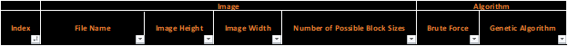
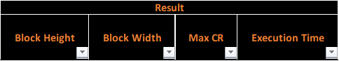
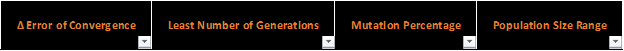
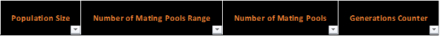
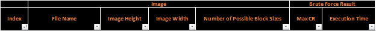
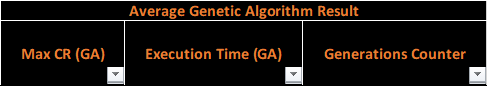

# **Image Compression   Constant Area Coding (CAC) Algorithm   with     Genetic Algorithm (GA)**

**Course: Computer Vision**

**Student Name: Moustafa Magdy Ahmed Othman Abu-Ghazy**

**Section: 4**

**4th Computer Engineering Branch**

**Electronics, Communication and Computer Department**

**Faculty of Engineering at Helwan, Helwan University**

#
## Constant Area Coding (CAC) Algorithm

## **Technique Type**

**Constant Area Coding (CAC) is a Lossless Compression Algorithm that allows the reconstruction of the exact original from the compressed data****reduces a file&#39;s size with no loss of quality.**

**Other Lossless Compression Technique Algorithms:**

1. **Run length encoding**
2. **Huffman encoding**
3. **Lempel–Ziv–Welch (LZW) coding**

## **Algorithm Steps**

1. **Special codeword&#39;s are used to identify large areas of contiguous 1&#39;s or 0&#39;s**
2. **The whole image (M\*N Pixels) is divided into blocks of size (P\*Q Pixels)**
3. **Blocks are classified as**

- **White (W) Blocks: having only white pixels**
- **Black (B) Blocks: having only black pixels**
- **Mixed (M) Blocks: having mixed intensity**.

1. **The most frequent occurring category is assigned with 1-bit codeword 0**
2. **If image contain only two categories, the other category is assigned with 1-bit codeword 1**
3. **Else the remaining other two categories are assigned with 2-bit codes 10 and 11**
4. **The codeword assigned to the Mixed (M) Block category is used as a prefix, which is followed by the P\*Q-bit pattern of the block.**
5. **Compression is achieved because the P\*Q bits that are normally used to represent each constant area (block) are replaced by a 1-bit or 2-bit codeword for White and Black Blocks**
6. **Compression Ratio (CR) = (N1 / N2)**

**Where:**

- **N1 = M\*N \* (Pixel Size)**

**Where: Pixel Size = 1-bit for 1-bit monochrome image**

**Pixel Size = 8-bit for 8-bit monochrome binary image**

- **N2 = (#no of W-Blocks) \* (Length of W-Block codeword)**

**+ (#no of B-Blocks) \* (Length of B-Block codeword)**

**+ (#no of M-Blocks) \* [(Length of B-Block codeword)**

**+ P\*Q\*(1-bit)]**

1. **Relative Data Redundancy (RD) = 1 – (1 / CR)**
2. **Root Mean Square Error (Er.m.s) = 0**
3. **Mean Square Signal to Noise Ratio (SNR<small>MS</small>) = ∞**

## **Algorithm Parameters**

**The Compression Ratio (CR) and Relative Data Redundancy (RD) depend on two main factors:**

1. **Nature of Image itself**
2. **Values of chosen block size (P\*Q)**

**To get the optimized values for block size (P\*Q) that achieve max Compression Ratio (CR) for a specific image we have to use one of the two ways:**

1. **Use Brute Force to test all possible sizes (P\*Q)**
2. **Use AI like Genetic Algorithm (GA) to minimize the search space and reach faster to an approximated solution**

## **Advanced Usage**

**The Constant Area Coding (CAC) Algorithm can also use for normal 8-bit monochrome image using concept of 1-bit plane, dividing the image into 8 1-bit planes then compress each plane individual and collect results together.**

**Also, it used to compress any stream of bits not only images.**

## **Example for (CAC) using Brute Force**
%20using%20Brute%20Force.png)

#
## Genetic Algorithm (GA)

## **Introduction**

**Genetic Algorithm (GA) is adaptive heuristic search algorithm based on the evolutionary ideas of natural selection and genetics. As such they represent an intelligent exploitation of a random search used to solve optimization problems. Although randomized, GA is by no means random, instead they exploit historical information to direct the search into the region of better performance within the search space.**

**It is better than conventional AI in that it is more robust. Unlike older AI systems, they do not break easily even if the inputs changed slightly, or in the presence of reasonable noise.**

**GAs simulate the survival of the fittest among individuals over consecutive generation for solving a problem. Each generation consists of a population of character strings that are analogous to the chromosome that we see in our DNA. Each individual represents a point in a search space and a possible solution. The individuals in the population are then made to go through a process of evolution.**

## **Algorithm Steps**

1. **Randomly initialize Populations**
2. **Evolution: Determine fitness of Population and ranking them**
3. **Repeat:**

1. **Select Mating Pools (Parents) from Populations**
2. **Perform crossover on Mating Pools resulting Offsprings**
3. **Perform mutation on Offsprings resulting Mutants**
4. **Set Mutants as the next generation Populations**
5. **Evolution: Determine fitness of Population and ranking them**

1. **Until Exit Condition**

**May be:**

1. **Reach maximum number of generations**
2. **Reach to a solution is good enough (Δ Error Convergence)**

**May add restriction on minimum number of generations to be executed**

**Effects of Genetic Operators:**

- **Using selection alone will tend to fill the population with copies of the best individual from the population**
- **Using selection and crossover operators will tend to cause the algorithms to converge on a good but sub-optimal solution**
- **Using mutation alone induces a random walk through the search space.**
- **Using selection and mutation creates a parallel, noise-tolerant, hill climbing algorithm**

## **Algorithm Parameters**

1. **Minimum Number of Generations**
2. **Δ Error for Convergence**
3. **Population Size**
4. **Number of Mating Pools**
5. **Mutation Percentage**

## **My Algorithm Notes For (CAC Algorithm)**

- **Chromosome consist of two Genes**

- **1st Gene: Block Width**
- **2nd Gene: Block Height**

- **Fitness Function: CAC returns Compression Ratio (CR)**
- **Minimum Number of Generations = 5**
- **Δ Error for Convergence = 0.00001**
- **Population Size:**

- **Random generated in range of (3, 10% of #no of Possible Solutions)**
- **= 3 if (#no of Possible Solutions \&lt; 30)**

- **Number of Mating Pools:**

- **Random generated in range of (2, Population Size)**
- **= Population Size if (Population Size \&lt; 2)**

- **Mutation Percentage {0%,50%,100%}: 50%**

## **Example for (CAC) using Genetic Algorithm (GA)**
%20using%20Genetic%20Algorithm%20(GA).png)

#
## Testing with Dataset

## **Dataset Information**

- **Dataset Size: 1407 Binary Image**

**(Dealt with them as 1-bit images)**

- **Brute Force Trials per Image: 1**
- **Brute Force Trials per Image: 10**
- **Total Number of Records: 15565**

## **Records Information**

**Genetic Algorithm**

## **Average Information per Image**

## **Results Analysis**

## **Conclusion**

1. **It&#39;s noticed the values of Average Genetic Algorithm** _ **Max CR are mostly near to the** _ **values of Brute Force** _ **Max CR** _
2. **It&#39;s noticed the** _ **Execution Time** _ **for Brute Force of Genetic Algorithm increasing with nonlinear behavior by the increase of the** _ **Number of Possible Sizes** _
3. **Average** _ **Execution Time** _ **of Genetic Algorithm is more less than** _ **Execution Time** _ **for Brute Force**
4. **It&#39;s notices the Generation Counter of Genetic Algorithm mostly hit 5 Generation. So, it&#39;s a reason for changing the** _ **Minimum Number of Generations** _ **to value less than 5 like to be 3**
